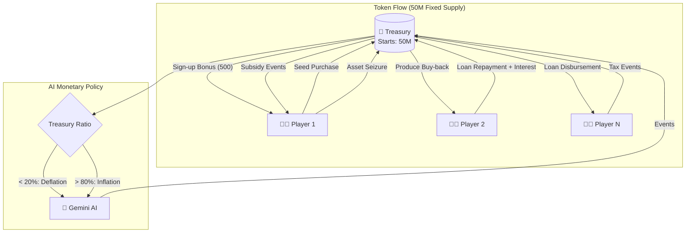
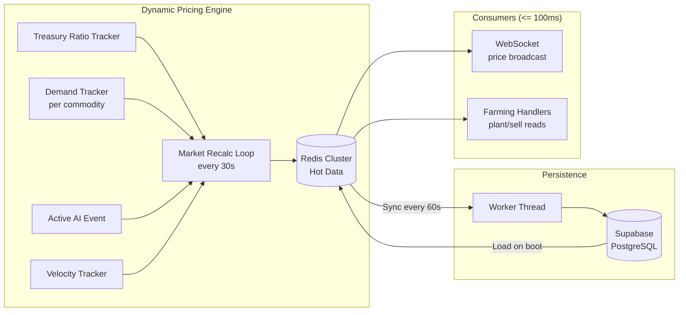
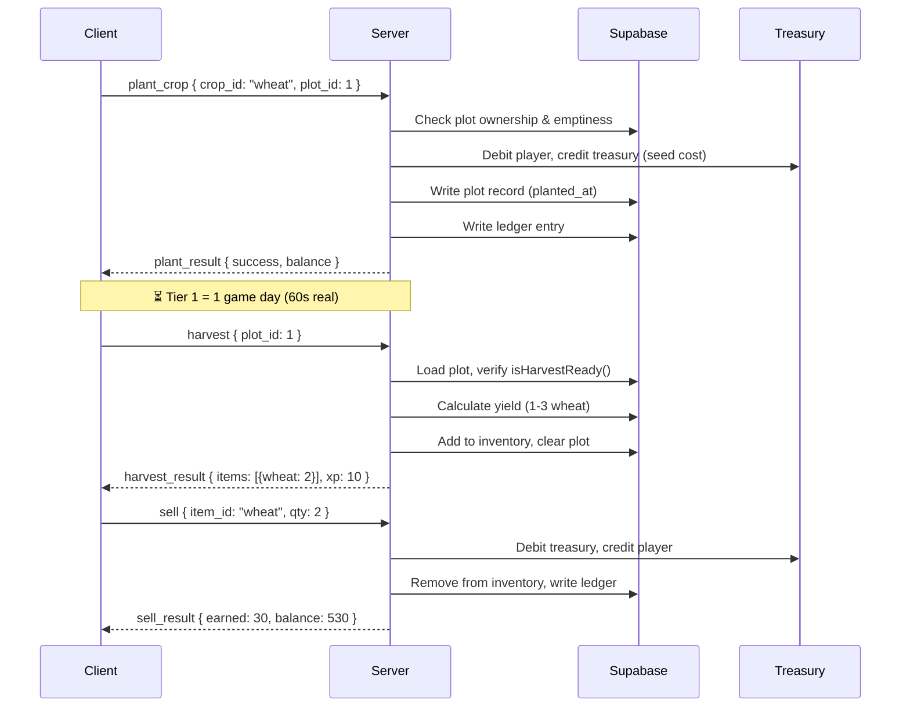

# Big Harvest — Game Economy Architecture

## Problem Statement

The backend currently broadcasts market data but has **no gameplay loop**. We need a full server-authoritative economy with:
- Strict **≤ 100ms response time** target for all gameplay actions via WebSockets.
- In-memory player state during active play, with final ledger settlement on WS disconnect.
- Fixed 50M token supply (future blockchain token)
- A **Treasury** (game bank) that is the sole source/sink of tokens
- Full gameplay loop: **plant → grow → harvest → sell → craft → rare animal produce**
- **Dynamic pricing** that scales with player count, token velocity, and supply/demand — stored in-memory with Supabase persistence
- AI-driven monetary policy to keep circulation healthy
- A loan system with collateral lock-ups and asset seizure

---

## 1. Token Supply Model

```
Total supply:  50,000,000 tokens (immutable)
```

At server genesis, the **Treasury** holds all 50M tokens. Tokens only exist in two places:

| Location | Description |
|----------|-------------|
| **Treasury** | The game bank. Holds unsold tokens. Pays farmers for produce. |
| **Player wallets** | In-game balances. Kept **in-memory** for fast (≤ 100ms) operations during active WS sessions, and completely synced/settled to the DB upon WS disconnect. |

> [!IMPORTANT]
> **Conservation law:** `treasury_balance + SUM(all player balances) + SUM(outstanding loans) = 50,000,000` — always.
> Every token transfer is a double-entry ledger write. No tokens are ever created or destroyed.

---

## 2. Treasury — The Game Bank

The Treasury is a singleton server-side entity, stored in the DB as a special row.

### Treasury Operations

| Operation | Flow | Description |
|-----------|------|-------------|
| **Sign-up bonus** | Treasury → Player | Dynamic amount (see §2.1) |
| **Plot purchase** | Player → Treasury | Player buys farmland at current plot price |
| **Seed purchase** | Player → Treasury | Player buys seeds at current market `buy_price` |
| **Produce sale** | Treasury → Player | Player sells harvested goods at current `sell_price` |
| **Loan disbursement** | Treasury → Player | Player receives loan amount |
| **Loan repayment** | Player → Treasury | Player pays back principal + interest |
| **Asset seizure** | Player → Treasury | Defaulted assets instantly seized and returned |
| **Event sink** | Players → Treasury | AI events like taxes, fees, disasters drain player tokens |
| **Event pump** | Treasury → Players | AI events like subsidies, bounties inject tokens |

### 2.1 Dynamic Sign-Up Bonus

The sign-up bonus is **not a fixed number**. It is calculated at registration time to give the player exactly enough to start farming:

```
signup_bonus = (2 × current_plot_price[tier_1]) + (2 × cheapest_seed_buy_price)
```

This guarantees every new player can afford **2 starter plots + 2 Tier 1 seeds** regardless of current market conditions. As the economy inflates or deflates, the bonus adjusts automatically.

> [!NOTE]
> The bonus is still a Treasury → Player transfer. As player count grows and prices rise, the bonus grows too — but the Treasury ratio bands will trigger AI deflation events to compensate.

---

## 2.2 Plot Pricing System

Plots are **purchasable assets** with tiered pricing. Players start with 0 plots and must buy them.

| Plot Tier | Base Price | Max Slots | Soil Bonus |
|-----------|-----------|-----------|------------|
| Starter | 50 tokens | 6 | None |
| Fertile | 200 tokens | 4 | +1 yield range |
| Premium | 500 tokens | 2 | +1 yield range, 10% faster growth |

**Dynamic plot pricing:** Like all commodities, plot prices shift with the treasury ratio:

```
current_plot_price = base_plot_price × treasury_mult
```

- When treasury is flush (>75%): plots are cheaper → encourages expansion
- When treasury is tight (<25%): plots are expensive → slows expansion

```
Client: { type: "buy_plot", tier: "starter" }
Server:
  1. Check player can afford current_plot_price
  2. Check player hasn't exceeded max plots for this tier
  3. Debit player, credit Treasury
  4. Create plot record
  5. Reply: { type: "buy_plot_result", plot_id, balance }
```

---

## 3. Dynamic Pricing Engine (Core Innovation)

Prices are **never static**. Every commodity has a live `buy_price` (seed cost) and `sell_price` (produce value) that shift based on 4 real-time factors.

### 3.1 Price Formula

```
sell_price = base_price × treasury_mult × demand_mult × event_mult × velocity_mult
buy_price  = sell_price × seed_ratio     (seed_ratio = 0.3 by default)
```

| Factor | Source | Range | What it does |
|--------|--------|-------|--------------|
| `treasury_mult` | `treasury_balance / 50M` | 0.6–1.5 | Scarcity valve: low treasury → expensive seeds, cheap produce |
| `demand_mult` | Per-commodity sales volume in last N hours | 0.5–2.0 | High demand → price rises. Oversupply → price drops |
| `event_mult` | AI-generated events (crash/surge/boycott) | 0.02–1.85 | Already exists in `events.ts` |
| `velocity_mult` | Token velocity (total tx volume / circulating supply) | 0.8–1.3 | Fast-moving economy → slight inflation. Stagnant → deflation |

### 3.2 Treasury Ratio Bands

```
treasury_ratio = treasury_balance / 50,000,000

< 0.15  → CRITICAL  → seed ×2.0, sell ×0.4, AI: emergency deflation
< 0.25  → TIGHT     → seed ×1.5, sell ×0.6, AI: austerity events
0.25–0.75 → NORMAL  → seed ×1.0, sell ×1.0
> 0.75  → FLUSH     → seed ×0.7, sell ×1.4, AI: stimulus events
> 0.85  → OVERFLOW  → seed ×0.5, sell ×1.8, AI: subsidies + bounties
```

### 3.3 Per-Commodity Demand Tracking

Each commodity has a rolling demand counter tracking sales volume over the last 2 hours. This is stored in **Redis**:

```typescript
// Redis Hash structure for each commodity (e.g. string key 'commodity:wheat')
interface CommodityState {
  id: string;
  current_buy_price: number;    // what players pay for seeds
  current_sell_price: number;   // what treasury pays for produce
  sales_last_2h: number;        // units sold to treasury in window
  purchases_last_2h: number;    // seeds bought in window
  demand_multiplier: number;    // calculated from sales velocity
  last_recalc_at: number;       // ms timestamp
}
```

**Demand curve logic:**
- If a commodity is being sold heavily → treasury has oversupply → `demand_mult` drops (price falls)
- If a commodity is rarely sold → treasury has scarcity → `demand_mult` rises (price rises)
- Seeds that are bought heavily → high planting demand → seed price rises slightly

### 3.4 Redis Cache + Supabase Persistence

All pricing and active player wallets live **in Redis (hot storage)** for zero-latency reads/writes during gameplay, supporting horizontal scaling. Supabase is the cold storage backup.

```
┌──────────────────────────────────────────────────────┐
│                       REDIS                          │
│  Hash: commodity:{id} (CommodityState)               │
│  String: treasury:balance                            │
│  Hash: player:{id}:balance                           │
│  Hash: stats:velocity                                │
│                                                      │
│  → Every gameplay action reads & writes here (0ms)   │
│  → Market loop reads here every 30 seconds           │
└──────────────────┬───────────────────────────────────┘
                   │ Sync every 60s + on WS disconnect
                   ▼
┌──────────────────────────────────────────────────────┐
│                   SUPABASE                           │
│  commodity_prices: full snapshot per commodity       │
│  treasury: balance, updated_at                       │
│  profiles: coins (wallet balance)                    │
│  price_history: append-only log for analytics        │
│                                                      │
│  → On server boot: load last snapshot into Redis     │
│  → On crash recovery: resume from last sync point    │
└──────────────────────────────────────────────────────┘
```

**Sync strategy:**
1. **Boot**: Load `commodity_prices` + `treasury` from Supabase → populate Redis cache.
2. **Player Connects**: Load player balance and assets from Supabase to Redis. All subsequent trades happen entirely in Redis (targeting <= 100ms latency).
3. **Tick (every 30s)**: Market loop recalculates all prices from current factors → updates Redis.
4. **Persist (every 60s)**: Background worker batch-writes Redis state back to `commodity_prices` table.
5. **Player Disconnects**: Flush final player balance from Redis to Supabase `profiles.coins` and write ledger transactions to settle the session.
6. **Price history (every 5 min)**: Append a snapshot row to `price_history` for charts/analytics.

### 3.5 Player-Count Scaling

As more players join, the economy auto-adjusts:

| Player Count | Effect |
|-------------|--------|
| < 100 | Generous pricing (bootstrap phase) |
| 100–1,000 | Normal pricing |
| 1,000–10,000 | Tighter margins, more AI deflation events |
| 10,000+ | Aggressive demand curves, frequent tax events |

The AI prompt includes `active_player_count` so Gemini can factor this into event generation.

---

## 4. Farming Loop (Server-Authoritative)

### 4.1 Planting

```
Client: { type: "plant_crop", crop_id: "wheat", plot_id: 1 }
Server:
  1. Verify player owns plot and plot is empty
  2. Read live buy_price from Redis commodity:{id}
  3. Debit player balance in Redis, credit Treasury in Redis
  4. Update demand tracker in Redis (purchases_last_2h++)
  5. Write plot record: { crop_id, planted_at: Date.now() }
  6. Reply: { type: "plant_result", success: true, balance: newBalance }
```

### 4.2 Growing

Pure time-based, using existing `clock.ts` constants. No server interaction needed — client shows a timer. Server validates on harvest.

### 4.3 Harvesting

```
Client: { type: "harvest", plot_id: 1 }
Server:
  1. Load plot → get planted_at, crop_id
  2. Call isHarvestReady(planted_at, tier, boosted)
  3. If not ready → reject
  4. Calculate yield (see §6 Yield Table)
  5. Add items to player inventory
  6. Clear plot (ready for replanting)
  7. Award XP
  8. Reply: { type: "harvest_result", items: [...], xp_gained: N }
```

### 4.4 Selling

```
Client: { type: "sell", item_id: "wheat", qty: 10 }
Server:
  1. Verify player has qty in inventory
  2. Read live sell_price from Redis commodity:{id}
  3. Credit player in Redis, debit Treasury in Redis
  4. Update demand tracker in Redis (sales_last_2h += qty)
  5. Log transaction in ledger (batch queue)
  6. Reply: { type: "sell_result", earned: N, balance: newBalance }
```

### 4.5 Crafting

```
Client: { type: "craft", recipe_id: "bread" }
Server:
  1. Look up recipe: bread requires flour ×1, egg ×1
  2. Verify player has all ingredients in inventory
  3. Debit ingredients from inventory
  4. Set crafting timer based on layer (clock.ts CRAFTING_TIME_MS)
  5. After timer: add crafted item to inventory, award XP
  6. Reply: { type: "craft_result", item: "bread", ready_at: timestamp }
```

### 4.6 Rare Animal Produce

Some animals have a **rare drop** alongside their normal produce:

| Animal | Normal Produce | Rare Produce | Rare Drop Rate |
|--------|---------------|-------------|----------------|
| Chicken | Egg | Golden Egg | 5% per cycle |
| Cow | Milk | Rich Milk | 8% per cycle |
| Bee | Honeycomb + Raw Honey | Royal Jelly | 3% per cycle |
| Pig | Pork | Truffle | 4% per cycle |
| Sheep | Raw Wool | — | — |

```
Client: { type: "collect_animal", animal_id: "uuid" }
Server:
  1. Verify ownership, check isProductionReady()
  2. Roll RNG for rare drop
  3. Add normal produce + rare (if rolled) to inventory
  4. Reset last_collected timestamp
  5. Award XP
  6. Reply: { type: "collect_result", items: [...], rare: true/false }
```

---

## 5. AI-Driven Monetary Policy

Extend the existing `events.ts` to include **economic events** that act as circulation valves. The AI now receives full economic telemetry.

### New Event Types

| Type | Effect | When Triggered |
|------|--------|----------------|
| `tax_harvest` | 5–15% of all sales go to Treasury | `treasury_ratio < 0.25` |
| `subsidy` | Treasury gives bonus tokens per sale | `treasury_ratio > 0.75` |
| `windfall` | Random players get small bonuses | `treasury_ratio > 0.80` |
| `blight` | Crops in ground destroyed (no yield) | Circulation too high |
| `golden_harvest` | 2× yield for certain crops | Circulation too low |
| `market_freeze` | No selling for N minutes | Emergency brake |
| `price_shock` | Specific commodity prices spike or crash hard | Demand imbalance detected |

### AI Prompt Extension (Economy-Aware)

The AI prompt now includes live economic telemetry:

```
ECONOMIC TELEMETRY:
- Treasury ratio: {ratio}% ({balance} / 50,000,000)
- Active players (last 1h): {count}
- Tokens in circulation: {circulating}
- Average player balance: {avg}
- Token velocity (tx/min): {velocity}
- Top 3 oversupplied commodities: {oversupplied}
- Top 3 undersupplied commodities: {undersupplied}

RULES:
- If treasury < 20%: generate DEFLATIONARY events (crash, tax, blight, market_freeze)
- If treasury > 80%: generate INFLATIONARY events (surge, subsidy, golden_harvest)
- If a specific commodity is heavily oversupplied: crash its price
- If a specific commodity is scarce: surge its price
- Factor in player count: more players = more aggressive balancing
```

---

## 6. Seed-to-Produce Yield Table

Each seed planted produces a **variable yield** based on tier.

| Tier | Seeds Consumed | Base Yield | Yield Range | Example |
|------|---------------|------------|-------------|---------|
| 1 | 1 seed | 2 produce | 1–3 | 1 Wheat seed → 2 Wheat |
| 2 | 1 seed | 2 produce | 1–4 | 1 Tomato seed → 2 Tomatoes |
| 3 | 1 seed | 1 produce | 1–2 | 1 Pumpkin seed → 1 Pumpkin |
| Special | 1 seed | 1 produce | 1–2 | 1 Indigo seed → 1 Indigo |

> [!NOTE]
> Yield variance adds gambling-like excitement. Fertilizer (crafted item) can shift the range upward by +1.

---

## 7. Loan System

### 7.1 Eligibility & Collateral

Loan eligibility is based on **hard assets** (land and animals), not cash. Collateral values are tied to current dynamic prices.

| Asset Type | Collateral Value |
|------------|------------------|
| Starter plot | `current_plot_price[starter]` per plot |
| Fertile plot | `current_plot_price[fertile]` per plot |
| Premium plot | `current_plot_price[premium]` per plot |
| Chicken | 100 tokens |
| Cow | 300 tokens |
| Pig | 400 tokens |
| Sheep | 250 tokens |
| Bee hive | 200 tokens |

```
max_loan = floor(total_collateral_value × 0.5)
```

### 7.2 Loan Terms

| Parameter | Value |
|-----------|-------|
| Interest rate | 10% flat |
| Repayment window | **1 game year** (365 game days) |
| Min loan | 100 tokens |
| Max concurrent loans | 1 per player |
| Grace period | 2 game days after due date |
| Asset Locking | Assets used as collateral are **locked** and cannot be sold, traded, or destroyed while the loan is active. |

### 7.3 Default & Seizure (Instant)

Seizure is **immediate** after the grace period expires — no warnings:

1. **Freeze** the player's overall sell ability
2. **Instantly seize locked collateral** starting from lowest-value first until debt is covered
3. Seized assets are destroyed (tokens returned to Treasury to maintain supply)
4. Player is marked with a `defaulted` flag (higher interest on next loan)
5. Broadcast a `loan_default` event to the player's private topic

---

## 8. Database Schema (New Tables)

### `treasury`
```sql
CREATE TABLE treasury (
  id           UUID PRIMARY KEY DEFAULT gen_random_uuid(),
  balance      BIGINT NOT NULL DEFAULT 50000000,
  epoch_ms     BIGINT NOT NULL,        -- persistent game epoch (fixes clock reset issue)
  created_at   TIMESTAMPTZ DEFAULT now(),
  updated_at   TIMESTAMPTZ DEFAULT now()
);
-- Single row, updated atomically on every transaction
```

### `commodity_prices` (Persistence Layer for Dynamic Pricing)
```sql
CREATE TABLE commodity_prices (
  id               TEXT PRIMARY KEY,  -- matches crop id (e.g. 'wheat')
  current_buy_price  NUMERIC(12,2) NOT NULL,
  current_sell_price NUMERIC(12,2) NOT NULL,
  demand_multiplier  NUMERIC(6,4) DEFAULT 1.0,
  sales_last_2h      INT DEFAULT 0,
  purchases_last_2h  INT DEFAULT 0,
  last_recalc_at     BIGINT NOT NULL,
  updated_at         TIMESTAMPTZ DEFAULT now()
);
-- One row per commodity. Background worker syncs from Redis every 60s.
```

### `price_history` (Analytics / Charts)
```sql
CREATE TABLE price_history (
  id           UUID PRIMARY KEY DEFAULT gen_random_uuid(),
  commodity_id TEXT NOT NULL,
  sell_price   NUMERIC(12,2) NOT NULL,
  buy_price    NUMERIC(12,2) NOT NULL,
  treasury_ratio NUMERIC(6,4),
  demand_mult  NUMERIC(6,4),
  event_mult   NUMERIC(6,4),
  player_count INT,
  snapshot_at  TIMESTAMPTZ DEFAULT now()
);
-- Append-only, one row per commodity per 5-minute snapshot
```

### `ledger` (Double-Entry Transaction Log)
```sql
CREATE TABLE ledger (
  id           UUID PRIMARY KEY DEFAULT gen_random_uuid(),
  from_type    TEXT NOT NULL,  -- 'treasury' | 'player'
  from_id      UUID NOT NULL,
  to_type      TEXT NOT NULL,  -- 'treasury' | 'player'
  to_id        UUID NOT NULL,
  amount       BIGINT NOT NULL CHECK (amount > 0),
  reason       TEXT NOT NULL,  -- 'signup_bonus','seed_purchase','produce_sale','loan','repayment','seizure','event'
  metadata     JSONB DEFAULT '{}',
  created_at   TIMESTAMPTZ DEFAULT now()
);
```

### `plots` (Player Farm State — Purchasable)
```sql
CREATE TABLE plots (
  id           UUID PRIMARY KEY DEFAULT gen_random_uuid(),
  profile_id   UUID NOT NULL REFERENCES profiles(id),
  plot_tier    TEXT NOT NULL DEFAULT 'starter',  -- 'starter','fertile','premium'
  slot_index   INT NOT NULL,
  crop_id      TEXT,              -- null = empty
  planted_at   BIGINT,            -- ms timestamp
  boost_applied BOOLEAN DEFAULT false,
  purchase_price BIGINT NOT NULL, -- price paid (for collateral valuation)
  locked_for_loan BOOLEAN DEFAULT false, -- True if currently pledged as collateral
  UNIQUE(profile_id, slot_index)
);
```

### `inventory`
```sql
CREATE TABLE inventory (
  id           UUID PRIMARY KEY DEFAULT gen_random_uuid(),
  profile_id   UUID NOT NULL REFERENCES profiles(id),
  item_id      TEXT NOT NULL,
  quantity     INT NOT NULL DEFAULT 0 CHECK (quantity >= 0),
  UNIQUE(profile_id, item_id)
);
```

### `animals`
```sql
CREATE TABLE animals (
  id              UUID PRIMARY KEY DEFAULT gen_random_uuid(),
  profile_id      UUID NOT NULL REFERENCES profiles(id),
  animal_type     TEXT NOT NULL,
  last_collected  BIGINT,         -- ms timestamp
  locked_for_loan BOOLEAN DEFAULT false, -- True if currently pledged as collateral
  created_at      TIMESTAMPTZ DEFAULT now()
);
```

### `loans`
```sql
CREATE TABLE loans (
  id             UUID PRIMARY KEY DEFAULT gen_random_uuid(),
  profile_id     UUID NOT NULL REFERENCES profiles(id),
  principal      BIGINT NOT NULL,
  interest_rate  NUMERIC(4,2) DEFAULT 0.10,
  total_due      BIGINT NOT NULL,
  due_at         BIGINT NOT NULL,       -- ms timestamp
  grace_until    BIGINT NOT NULL,       -- ms timestamp
  status         TEXT DEFAULT 'active', -- 'active','repaid','defaulted'
  collateral     JSONB NOT NULL,        -- snapshot of pledged assets
  created_at     TIMESTAMPTZ DEFAULT now()
);
```

### Update `profiles`
Add `coins BIGINT DEFAULT 0` (start at 0; the dynamic sign-up bonus is a ledger transfer from Treasury).

---

## 9. New WebSocket Messages

### Client → Server (New)

| Type | Payload | Description |
|------|---------|-------------|
| `buy_plot` | `{ tier }` | Buy a new farm plot |
| `plant_crop` | `{ crop_id, plot_id }` | Plant a seed |
| `harvest` | `{ plot_id }` | Harvest a ready crop |
| `sell` | `{ item_id, qty }` | Sell produce to Treasury |
| `buy_seed` | `{ crop_id, qty }` | Buy seeds from Treasury |
| `request_loan` | `{ amount }` | Request a loan |
| `repay_loan` | `{ loan_id, amount }` | Repay a loan |
| `collect_animal` | `{ animal_id }` | Collect animal produce |
| `craft` | `{ recipe_id }` | Craft an item |

### Server → Client (New)

| Type | Payload | Description |
|------|---------|-------------|
| `balance_update` | `{ balance, treasury_ratio }` | After any token movement |
| `buy_plot_result` | `{ plot_id, tier, balance }` | Plot purchase confirmation |
| `plant_result` | `{ success, plot_state, balance }` | Planting confirmation |
| `harvest_result` | `{ items[], xp, balance }` | Harvest results with yield |
| `sell_result` | `{ earned, balance }` | Sale confirmation |
| `buy_result` | `{ success, balance, inventory }` | Seed purchase result |
| `craft_result` | `{ item, ready_at }` | Crafting started confirmation |
| `craft_complete` | `{ item, qty }` | Crafting finished |
| `collect_result` | `{ items[], rare }` | Animal produce collected |
| `loan_result` | `{ loan_id, amount, due_at }` | Loan approved |
| `loan_default` | `{ seized_assets[], remaining_debt }` | Instant asset seizure notice |
| `price_update` | `{ prices: CommodityState[] }` | Live price tick (every 30s) |
| `economic_event` | `{ type, description, ... }` | AI monetary policy event |

---

## 10. New Source Files

| File | Purpose |
|------|---------|
| `src/economy/redis.ts` | Shared Redis client initialization and cache keys |
| `src/economy/treasury.ts` | Treasury singleton: balance tracking in Redis, ratio calc, pricing multipliers |
| `src/economy/pricing.ts` | **Dynamic pricing engine**: Redis read/writes, demand tracking, recalc loop, worker sync to Supabase |
| `src/economy/ledger.ts` | Double-entry ledger writes (all token transfers queued through Redis streams or direct insert) |
| `src/economy/loans.ts` | Loan eligibility, disbursement, repayment, seizure engine |
| `src/economy/yields.ts` | Yield calculation with randomness and fertilizer bonuses |
| `src/economy/policy.ts` | AI monetary policy: extends `events.ts` with treasury-aware prompts |
| `src/game/farming.ts` | Plant, harvest, sell, buy handlers (gameplay actions, hot reads from Redis) |
| `src/game/animals.ts` | Animal collection + rare drop RNG |
| `src/game/crafting.ts` | Crafting handlers with timer management |

---

## 11. Architecture Diagram







---

## Confirmed Design Decisions

| Decision | Resolution |
|----------|------------|
| **Latency Target** | **≤ 100ms** for all operations via WebSockets ✅ |
| **Hot Data Storage**| **Redis** for all active balances, pricing, and demands ✅ |
| **Ledger Settlement**| Balances live in Redis, settled to DB on WS disconnect ✅ |
| **Seed pricing** | `buy_price = sell_price × 0.3` ✅ |
| **Sign-up bonus** | Dynamic: `2 × plot_price + 2 × cheapest_seed` ✅ |
| **Loan Terms** | 1 game year. Collateral assets are **locked** (unsellable) ✅ |
| **Loan seizure** | Instant after grace period — no warnings ✅ |
| **Persistent epoch** | Stored in `treasury.epoch_ms` (breaking change to `clock.ts`) ✅ |
| **Supabase sync** | Every 60 seconds ✅ |
| **Plots** | Purchasable with tiered pricing (Starter 50, Fertile 200, Premium 500) ✅ |

---

## Verification Plan

### Automated Tests
- **Unit tests** for `treasury.ts`: verify conservation law holds after sign-up, buy, sell, loan, and seizure operations
- **Unit tests** for `yields.ts`: verify yield ranges per tier, fertilizer bonus capping
- **Unit tests** for `loans.ts`: verify eligibility calculation, interest computation, seizure logic
- **Integration tests** for the full plant→harvest→sell flow via WebSocket mock

> [!NOTE]
> No existing test infrastructure found in the codebase. We will need to set up a test runner (likely `vitest` given the project uses TypeScript + ESM). Exact test commands TBD during execution — I'd like your input on preferred test framework.

### Manual Verification
- Connect a WebSocket client (e.g., `wscat` or Postman), authenticate, and execute the full plant→harvest→sell loop
- Verify Treasury balance changes are reflected correctly after each operation
- Trigger an AI economic event and verify pricing adjustments
